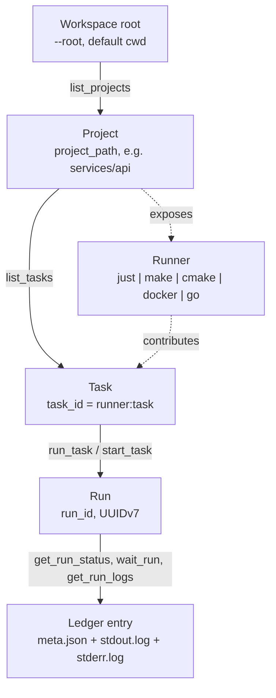
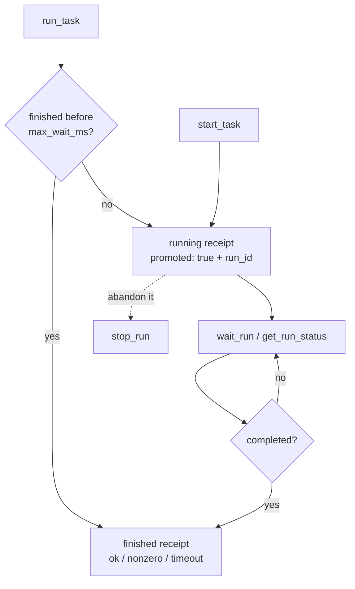

# Agent guide

How `just-mcp-work` (JMW) models a workspace, what its MCP tools do, and how a
coding agent should drive them. The server ships short usage rules in its MCP
`instructions` field; this page is the long form behind them.

- [What the server is for](#what-the-server-is-for)
- [The object model](#the-object-model)
- [Discovery](#discovery)
- [Task identity per runner](#task-identity-per-runner)
- [Runner modes](#runner-modes)
- [The run lifecycle](#the-run-lifecycle)
- [Tool reference](#tool-reference)
- [Choosing the right call](#choosing-the-right-call)
- [Failure modes](#failure-modes)
- [Server configuration](#server-configuration)
- [On-disk layout](#on-disk-layout)

## What the server is for

An agent working in a repository burns context twice on the same thing: once
reading build files to learn what can be run, and again reading the whole log
of a command whose only interesting part was "it passed".

JMW removes both costs.

- **Discovery on demand.** Justfiles, Makefiles, `CMakeLists.txt`, Dockerfiles,
  Compose manifests, and `go.mod` files are parsed when asked. The agent
  requests one project or one task and gets that, not a catalog.
- **A receipt instead of a log.** A finished run answers with status, exit
  code, and duration. Output tails are attached only when the run failed. The
  full `stdout` and `stderr` stay on disk, one call away.
- **Background runs.** A slow run is promoted to the background with a `run_id`
  that can be polled, waited on, or stopped, so a check gate never blocks the
  turn.

The rule that follows: route a command through JMW when you need to know
*whether* it worked, and use a normal shell when its output *is* the answer -
`git diff`, a search, a generated report. Sending text you must read in full
through JMW pays for it twice.

## The object model

Four identifiers address everything. Each is produced by one tool and consumed
by the next.



- **Workspace** - one root directory, fixed at server start. Nothing above it
  is discovered, read, or run.
- **Project** - a directory holding at least one runner, addressed by
  `project_path`: workspace-relative, slash-separated, the root itself being
  `.`. Produced by `list_projects`.
- **Runner** - a build-tool backend detected in that directory: `just`, `make`,
  `cmake`, `docker`, or `go`.
- **Task** - one runnable thing, addressed by `task_id`, always namespaced
  `<runner>:<task>`. Produced by `list_tasks`.
- **Run** - one process, addressed by `run_id`, a UUIDv7 that stays valid after
  the process ends. Produced by `run_task`, `start_task`, and the shell tools.

A project is a *directory*, not a repository: one repository can hold many
projects, and one directory can expose several runners at once - a `justfile`
next to a `go.mod` is two runners in one project.

## Discovery

### What makes a directory a project

- **`just`** - a `justfile`, `Justfile`, or `.justfile`. Tasks come from the
  `just` JSON dump, including modules and imports.
- **`make`** - a `GNUmakefile`, `Makefile`, or `makefile`. Tasks are the
  literal rule targets parsed out of the file; dynamic, wildcard, and pattern
  targets are skipped.
- **`cmake`** - a `CMakeLists.txt`. Tasks come from `CMakePresets.json` and
  `CMakeUserPresets.json`, plus the targets of build trees that are already
  configured, read from `CMakeCache.txt` and `build.ninja`.
- **`docker`** - a `Dockerfile`, or a Compose manifest named `compose.yaml`,
  `compose.yml`, `docker-compose.yaml`, or `docker-compose.yml`, with their
  `.override.` companions. Compose services and profiles are enumerated by
  Docker itself.
- **`go`** - a regular `go.mod`. The task table is fixed and synthesized; the
  module is never parsed for targets.

Listing never configures, generates, or builds anything. CMake targets come
from a build tree that already exists; a project that was never configured
shows only its presets.

### Scan defaults and pruning

`list_projects` scans depth 0-1 below the workspace root and skips
dot-directories. Widen it deliberately:

- `path` picks a subtree and re-bases the depth counter on it.
- `max_depth` counts levels below `path`; `-1` is unlimited.
- `include_hidden: true` descends into dot-directories.
- `runners` keeps only projects exposing one of the named runners.

Some directories are never scanned: `.git`, `node_modules`, `target`,
`.just-mcp-work`, and whatever the operator passed to `--exclude`. Symlinked
directories are not followed. Exclusions are an operator setting and cannot be
widened over MCP.

The `applied_filter` field reports the effective filter and a `pruned`
breakdown: `depth`, `hidden`, and `excluded` count skipped directory subtrees,
`runner_mismatch` counts inspected projects dropped by the `runners` filter.
When a project you expected is missing, read those counters before guessing.

`list_tasks` resolves `project_path` on its own, scanning that exact directory
with hidden directories included. A project the default scan prunes is still
addressable by path.

### Included projects and worktrees

A `justfile` that imports another one, or declares modules, already exposes
those recipes. JMW then suppresses the `just` runner in the included
directories, so one recipe is never offered twice under two project paths.

A linked Git worktree is discovered even when it sits outside the normal scan,
and carries a `worktree.main_checkout` field with the workspace-relative path
of its main checkout, or `<outside-workspace>`.

### Status, errors, warnings

Every project carries a `status` plus two optional per-runner maps.

- `errors` - the runner failed here, typically an unparsable task file. The
  project status becomes `error`; the other runners keep working.
- `warnings` - the runner cannot contribute tasks, but the checkout is fine.
  The usual cause is a build tool that is not installed on this host. The
  status stays `ready`.

`list_tasks` repeats both maps, narrowed to the requested runner, so a listing
that returns nothing explains itself without a second call.

## Task identity per runner

- **`just`** - `just:<namepath>`, for example `just:verify` or
  `just:docs::build` for a module recipe. Arguments fill the recipe parameters
  reported in `parameters`.
- **`make`** - `make:<target>`, for example `make:test`. Arguments follow the
  target on the `make` command line.
- **`cmake`** - `cmake:<kind>:<name>` for presets, where `kind` is `configure`,
  `build`, `test`, `package`, or `workflow`. Configured build-tree targets use
  `cmake:target:<build-dir>:<target>`, with both parts URL-escaped.
- **`docker`** - `docker:build` for the Dockerfile, `docker:compose:up`,
  `docker:compose:down`, and `docker:compose:up:<service>` for Compose.
  Arguments are options; a bare word is taken by Compose as another service.
- **`go`** - `go:build`, `go:test`, `go:vet`, `go:mod:download`, and, in `all`
  mode, `go:fmt`, `go:mod:tidy`, and `go:any`. Every fixed task rejects
  arguments; only `go:any` forwards argv.

Two task fields are worth reading before invoking anything:

- `parameters` - name, kind (`singular`, `plus`, `star`), default, and doc.
  They survive `detail: compact`, because a parameterized task cannot be
  called without them.
- `private` - the runner marked this task as an internal helper, such as a
  `just` recipe starting with `_` or carrying `[private]`. Hide them with
  `visibility: public`.

The `metadata` map carries runner-specific detail: `just` aliases, groups, and
modules; the Compose service and kind; the CMake build directory; the Make
target. `detail: compact` drops it.

Compose services start **detached**. Their containers outlive the run that
started them until `docker:compose:down` stops them.

## Runner modes

Every runner registers a permission declaration, and the operator picks a mode
during `init`. The choice is persisted in the server arguments, so the task
surface an agent sees is already the authorized one.

| Runner | Modes | Default |
| --- | --- | --- |
| `go` | `safe`, `all`, `disabled` | `safe` |
| `just`, `make`, `cmake`, `docker` | `all`, `disabled` | `all` |

In Go `safe` mode the four fixed tasks reject caller arguments outright. `all`
adds `go:fmt`, `go:mod:tidy`, and the unrestricted `go:any`. `disabled` does
not construct the runner at all, so nothing Go-related is discovered or run.
Just, Make, CMake, and Docker are still unreviewed: they offer their existing
unrestricted surface or nothing.

**A task can be absent on purpose.** When a task you expected is not in the
listing, the operator may have withheld its runner. Never reconstruct it
through `run_shell_command`, `start_shell_command`, or any other shell path:
that defeats the only server-side authorization mechanism there is. Modes
reduce the exposed surface; they are not a sandbox. See
[SECURITY.md](../SECURITY.md).

## The run lifecycle



`run_task` waits up to `max_wait_ms`, which defaults to the server's
`--sync-deadline` of one minute. When that wait expires the run is
**promoted**: it keeps going in the background, and the receipt carries
`promoted: true` with a `run_id`. That is a normal answer, not a failure -
follow the `run_id`, and never launch the task again. `max_wait_ms: 0` promotes
immediately; `-1` waits until the process ends, bounded only by the task
timeout.

`start_task` skips the synchronous phase and returns a `run_id` at once. Prefer
it for `check`, `verify`, and CI-style gates, and for any task whose `stats`
report a long average duration.

### Statuses

| Status | Meaning | `ok` |
| --- | --- | --- |
| `running` | The process is alive. | - |
| `ok` | Exited zero. | `true` |
| `nonzero` | Exited non-zero. | `false` |
| `timeout` | Killed at the task timeout. | `false` |
| `cancelled` | Stopped by `stop_run` or shutdown. | `false` |
| `spawn_error` | Never started at all. | `false` |

`spawn_error` covers an unknown task, arguments a runner rejected, an invalid
working directory, and a process that failed to start. It arrives as a normal
receipt with an explanation in `message`, not as a tool error.

### What a receipt actually contains

- **Success.** `ok: true`, `exit_code: 0`, `duration_ms`, `status: ok` - and no
  output tails at all. Trust it; do not fetch logs to re-check a green run.
- **Failure.** The same fields plus `stdout_tail` and `stderr_tail`. On a run
  that finished synchronously each tail holds up to the last 64 KiB of that
  stream.
- **Promotion.** `status: running`, `promoted: true`, `run_id`, and up to 4096
  bytes of each tail so far.
- **Status calls.** `get_run_status`, `wait_run`, and `stop_run` read tails
  from disk, `tail_bytes` per stream: default 4096, maximum 65536, `0` disables
  them.

Receipts for a live or finished run also carry lifecycle detail worth reading
before you act: `completed`, `process_alive`, `owned_by_this_server`,
`last_output_age_ms`, `no_output_yet`, `stdout_bytes`, `stderr_bytes`,
`task_timeout_ms`, and `time_to_task_timeout_ms`. A gate that has printed
nothing for minutes and a gate about to hit its timeout look identical in
`status` alone.

The `stats` block compares this invocation with its own history. `exact`
aggregates runs of the same task with the same arguments, `task` aggregates the
same task with any arguments. Both report `runs`, `measured_runs`, `last`,
`avg`, `min`, and `max` duration, `last_status`, `last_run_at`, and
`aborted_runs`. Read `avg_duration_ms` to choose between `run_task` and
`start_task`.

### Timeouts, termination, concurrency

- Every run has a timeout: `--timeout`, 15 minutes by default, `0` disables it.
- On timeout or cancellation the whole child process tree is terminated,
  best-effort. A task that deliberately daemonizes can survive.
- One server owns at most 32 live runs; further starts are rejected.
- `stop_run` works only for runs this server process started. A run owned by
  another process reports its `owner_pid` and is left alone.
- When the client sends a progress token, a synchronous run emits progress
  notifications every 10 seconds.

## Tool reference

Discovery:

- **`list_projects`** - what can be run in this workspace. Inputs: `path`,
  `max_depth`, `include_hidden`, `runners`.
- **`list_tasks`** - what can be run in one project. Inputs: `project_path`,
  `runner`, one of `names` / `name_prefix` / `query`, `visibility`, `detail`,
  `include_stats`, `include_metadata`.

Execution:

- **`run_task`** - run a discovered task and wait a bounded time. Inputs:
  `project_path`, `task_id`, `arguments`, `max_wait_ms`.
- **`start_task`** - start it in the background and return a `run_id`. Same
  inputs without the wait.
- **`run_shell_command`** - an ad-hoc command with a receipt. Inputs:
  `command`, `working_directory`, `max_wait_ms`.
- **`start_shell_command`** - the same, in the background.

Observation:

- **`get_run_status`** - a non-blocking snapshot. Inputs: `run_id`,
  `tail_bytes`.
- **`wait_run`** - block until the run finishes or the wait expires; the run
  keeps going either way. Inputs: `run_id`, `max_wait_ms` (default 30000,
  maximum 600000), `tail_bytes`.
- **`stop_run`** - terminate a run this server owns. Inputs: `run_id`,
  `tail_bytes`.
- **`get_run`** - the full persisted metadata of one run, including
  `runner_version`, PIDs, byte counts, and truncation flags. Input: `run_id`.
- **`get_run_logs`** - a byte range of one stream. Inputs: `run_id`, `stream`,
  `offset`, `limit`, `encoding`.
- **`list_runs`** - recent runs, newest first. Inputs: `status`,
  `project_path`, `task_id`, `limit`, `cursor`.
- **`version_status`** - compare the installed version with the latest stable
  GitHub release.

### Filtering a task listing

The most expensive answer this server can give is the full catalog of a large
project. Ask for what you need:

- `names` - exact task names or task IDs you already expect.
- `name_prefix` - a case-sensitive prefix, for a naming convention.
- `query` - a case-insensitive substring of the name *or* the description.
- Those three answer different questions and **must not be combined**; use one
  per call. Every other selector composes freely.
- `visibility: public` drops private helper tasks.
- `detail: compact` keeps identity and parameters, trims the description to its
  first line and 160 runes, and drops metadata and statistics. Restore either
  one explicitly with `include_metadata` or `include_stats`.

`applied_filter` reports what the server applied, how many tasks each stage
removed (`pruned.runner`, `pruned.visibility`, `pruned.name`), and
`unknown_names`: requested names that exist nowhere in the project. An entry in
`unknown_names` means your name is wrong; an empty result with
`pruned.name: 0` means the project has no tasks at all.

### Reading output

`get_run_logs` pages raw bytes of one stream. `stream` is `stdout` or
`stderr`; `offset` and `limit` are byte counts, the limit defaulting to 65536.
The response returns `next_offset` to resume from. The default
`encoding: utf8` refuses a range that is not complete valid UTF-8 - move the
range, or ask for `base64`. Reach for this tool only when the tails did not
explain the failure.

### Listing history

`list_runs` returns `run_id`, `status`, `project_path`, `task_id`, `args`,
`started_at`, `duration_ms`, and `last_output_age_ms` for live runs. `limit`
defaults to 20 and is capped at 200. One call scans at most 2000 ledger
entries and returns `truncated` with `next_cursor` when more remain. Use it to
recover a `run_id` you lost, or to check whether a gate is already running
before starting a second copy of it.

## Choosing the right call

**Run a check gate.**

1. `list_tasks` with `names: ["verify"]`, or `query: "check"`, and
   `detail: compact`.
2. Read `stats.task.avg_duration_ms`. Long: `start_task`. Short: `run_task`.
3. `wait_run` with a `max_wait_ms` you are willing to spend, repeated while
   `completed` is false.
4. Green: stop there. Report the status and exit code.
5. Red: read `stderr_tail`, then `stdout_tail`, and only then `get_run_logs`.

**Diagnose a run that looks stuck.** Call `get_run_status` with
`tail_bytes: 0`, then compare `last_output_age_ms` against
`time_to_task_timeout_ms` and check `process_alive`. A silent live process is
usually waiting on something, not hung.

**Run something that has no task.** Use `run_shell_command` with a
workspace-relative `working_directory`, default `.`, and only when a compact
receipt is worth more than the full output. Shell runs land in the same ledger
under the task ID `shell:command`, so `list_runs` and `get_run_logs` work on
them too.

**Do not route through JMW** anything whose full output you must read or
quote: `git diff`, `git log`, searches, source excerpts, generated reports, or
output the user asked to see. Use a normal shell or a read tool for those.

**When you delegate**, carry these rules into the sub-agent's prompt. A
delegated build that pours a full log into its own context defeats the purpose.

## Failure modes

- `unknown project_path` - the path is not a discovered project, or is not
  workspace-relative. Re-run `list_projects` with a wider `path` or
  `max_depth`.
- `unknown task_id "..." for project "..."` - a wrong ID, or a runner mode
  withheld the task. Check `list_tasks` with `names`, read the project
  warnings, and do not rebuild the task in a shell.
- `task_id must be namespaced as <runner>:<task>` - the bare task name was
  sent. Use the `task_id` field, not `name`.
- An empty task list with a project warning - the build tool is missing on this
  host. Nothing in the checkout is broken.
- `status: error` on a project - a task file could not be parsed. Read
  `errors[<runner>]`; the other runners still work.
- `names and query must not be combined` - two exclusive task selectors in one
  call. Send one per call.
- `log range is not complete valid UTF-8` - a multi-byte sequence is split
  across the page boundary. Move `offset` or `limit`, or use `base64`.
- `run ... is owned by PID N and cannot be stopped` - another server process
  started it, and only that process can stop it.
- `max_wait_ms must be between 0 and 600000` - `wait_run` accepts at most ten
  minutes per call. Call it again; the run keeps going.

Tool errors arrive as an MCP error result whose payload carries
`error.message`.

## Server configuration

The operator sets these; an agent cannot change them at runtime.

| Flag | Environment | Default | Effect |
| --- | --- | --- | --- |
| `--root` | `JMW_ROOT` | cwd | Workspace scope. |
| `--timeout` | `JMW_TIMEOUT` | `15m` | Per-run timeout; `0` disables it. |
| `--sync-deadline` | `JMW_SYNC_DEADLINE` | `1m` | Default synchronous wait. |
| `--retention` | `JMW_RETENTION` | `72h` | Run-log retention. |
| `--exclude` | - | none | Extra directories to skip. |
| `--runner-mode` | - | per runner | Runner authorization. |

`just-mcp-work init` writes the managed instruction block and the MCP
configuration for the selected agents, and persists the runner selection in the
server arguments. The [README](../README.md) covers that setup flow.

## On-disk layout

```text
<workspace root>/.just-mcp-work/
├── version.json              update-check state
└── log/
    └── <run_id>/
        ├── meta.json         status, exit code, timings, PIDs
        ├── stdout.log        raw stream
        └── stderr.log        raw stream
```

This ledger is the source of truth for `get_run`, `get_run_logs`, `list_runs`,
and the duration statistics. Later runs prune it according to `--retention`.
Treat the logs as build output that may contain whatever a task echoed,
including secrets.
