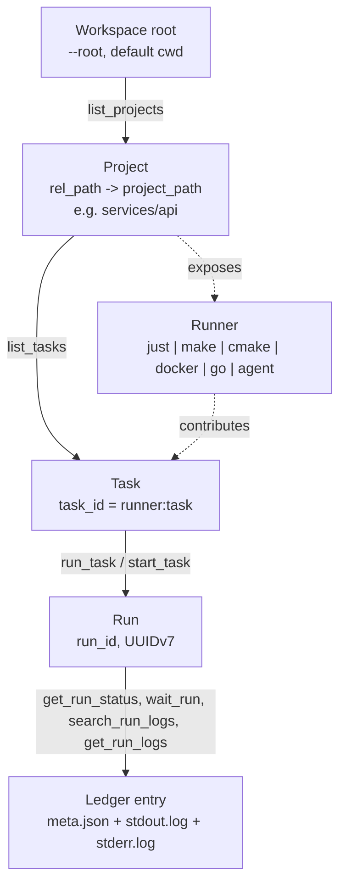
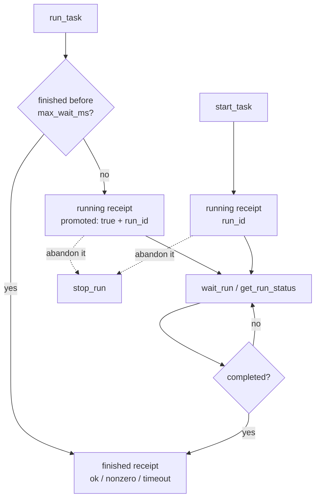

# Agent guide

How `just-mcp-work` (JMW) models a workspace, what its MCP tools do, and how a
coding agent should drive them. The server has two forms of usage rules in its
MCP `instructions` field: with a verified `.just-mcp-work/guide.txt`, it serves
the short rules that must fire unprompted and points to that file by its
verified absolute path; without a verified guide path, it serves the full usage
text. When `serve` runs with `--ai`, both forms start with the declared AI
family, profile ID, profile version, and transport; without it they carry no
profile. The JMW contract that follows is the same in every form. This page is
the project's public long form.

- [What the server is for](#what-the-server-is-for)
- [The object model](#the-object-model)
- [Discovery](#discovery)
- [Task identity per runner](#task-identity-per-runner)
- [Runner modes](#runner-modes)
- [The run lifecycle](#the-run-lifecycle)
- [Restricting a run's writes](#restricting-a-runs-writes)
- [Tool reference](#tool-reference)
- [Choosing the right call](#choosing-the-right-call)
- [Failure modes](#failure-modes)
- [Server configuration](#server-configuration)
- [On-disk layout](#on-disk-layout)

## What the server is for

An agent working in a repository burns context twice on the same thing: once
reading build files to learn what can be run, and again reading the whole log
of a command whose only interesting part was "it passed".

JMW removes both costs.

- **Discovery on demand.** Justfiles, Makefiles, `CMakeLists.txt`, Dockerfiles,
  Compose manifests, and `go.mod` files are parsed when asked. The agent
  requests one project or one task and gets that, not a catalog.
- **A receipt instead of a log.** A finished run answers with status, exit
  code, and duration; by default, tails appear only on failure. `tail_bytes`
  can request them on success. A synchronous shell run can also parse bounded
  stdout as structured JSON. The full `stdout` and `stderr` stay on disk.
- **Background runs.** A slow run is promoted to the background with a `run_id`
  that can be polled, waited on, or stopped, so a check gate never blocks the
  turn.

Route a command through JMW whenever a receipt or tail answers the question;
use a normal shell only when the output you need is too large for a tail.
Sending text you must read in full through JMW pays twice.

## The object model

Four identifiers address everything. Each is produced by one tool and consumed
by the next.



- **Workspace** - one root directory, fixed at server start. Nothing above it
  is discovered, read, or run.
- **Project** - a directory holding at least one runner. `list_projects`
  returns its workspace-relative, slash-separated path as `rel_path`, with `.`
  for the root itself. Pass that value unchanged as `project_path` to
  `list_tasks`, `run_task`, or `start_task`.
- **Runner** - a backend detected in that directory that parses project data or
  provides a synthesized task table: `just`, `make`, `cmake`, `docker`, `go`,
  or `agent`.
- **Task** - one runnable thing, addressed by `task_id`, always namespaced
  `<runner>:<task>`. Produced by `list_tasks`.
- **Run** - one process, addressed by `run_id`, a UUIDv7 that stays valid after
  the process ends. Produced by `run_task`, `start_task`, and the shell tools.

A project is a *directory*, not a repository: one repository can hold many
projects, and one directory can expose several runners at once - a `justfile`
next to a `go.mod` is two runners in one project.

## Discovery

### What makes a directory a project

- **`just`** - a `justfile`, `Justfile`, or `.justfile`. Tasks come from the
  `just` JSON dump, including modules and imports.
- **`make`** - a `GNUmakefile`, `Makefile`, or `makefile`. Tasks are the
  literal rule targets parsed out of the file; dynamic, wildcard, and pattern
  targets are skipped.
- **`cmake`** - a `CMakeLists.txt`. Tasks come from `CMakePresets.json` and
  `CMakeUserPresets.json`, plus the targets of build trees that are already
  configured, read from `CMakeCache.txt` and `build.ninja`.
- **`docker`** - a `Dockerfile`, or a Compose manifest named `compose.yaml`,
  `compose.yml`, `docker-compose.yaml`, or `docker-compose.yml`, with their
  `.override.` companions. Compose services and profiles are enumerated by
  Docker itself.
- **`go`** - a regular `go.mod`. The task table is fixed and synthesized; the
  module is never parsed for targets.
- **`agent`** - a `.git` entry in the project directory that is a directory or
  regular file, not a symlink. Its tasks come from a fixed table and appear only
  for the CLI binaries present on the host.

Listing never configures, generates, or builds anything. CMake targets come
from a build tree that already exists; a project that was never configured
shows only its presets.

### Scan defaults and pruning

`list_projects` scans depth 0-1 below the workspace root and skips
dot-directories. Widen it deliberately:

- `path` picks a subtree and re-bases the depth counter on it.
- `max_depth` counts levels below `path`; `-1` is unlimited.
- `include_hidden: true` descends into dot-directories.
- `runners` keeps only projects exposing one of the named runners.

Some directories are never descended into while scanning: `.git`,
`node_modules`, `target`,
`.just-mcp-work`, and whatever the operator passed to `--exclude`. Symlinked
directories are not followed. Exclusions are an operator setting and cannot be
widened over MCP.

The `applied_filter` field reports the effective filter and a `pruned`
breakdown: `depth`, `hidden`, and `excluded` count skipped directory subtrees,
`runner_mismatch` counts inspected projects dropped by the `runners` filter.
When a project you expected is missing, read those counters before guessing.

`list_tasks` resolves `project_path` on its own, scanning that exact directory
with hidden directories included. A project the default scan prunes is still
addressable by path.

### Included projects and worktrees

A `justfile` that imports another one, or declares modules, already exposes
those recipes. JMW then suppresses the `just` runner in the included
directories, so one recipe is never offered twice under two project paths.

A linked Git worktree is discovered even when it sits outside the normal scan,
and carries a `worktree.main_checkout` field with the workspace-relative path
of its main checkout, `<outside-workspace>` when the repository lives outside
the workspace, or `<bare-repository>` when it is a worktree of a bare
repository. The two bracketed values are sentinels, not paths - do not try to
resolve them.

### Status, errors, warnings

Every project carries a `status` plus two optional maps. Their keys are runner
names, plus a small set of reserved keys that describe the project itself.

- `errors` - keyed by runner name, the runner failed here, typically an
  unparsable task file; the other runners keep working. The reserved key
  `worktree` means the project's Git worktree metadata could not be classified:
  every runner and every task is unaffected, only the `worktree.main_checkout`
  annotation is missing. Either way the project status becomes `error`.
- `warnings` - the runner cannot contribute tasks, but the checkout is fine.
  The usual cause is a build tool that is not installed on this host. The
  status stays `ready`.

`list_tasks` repeats both maps. With a `runner` filter it drops only the issues
owned by other runners and keeps the reserved keys, so a listing that returns
nothing explains itself without a second call.

## Task identity per runner

- **`just`** - `just:<namepath>`, for example `just:verify` or
  `just:docs::build` for a module recipe. Arguments fill the recipe parameters
  reported in `parameters` as positional values.
- **`make`** - `make:<target>`, for example `make:test`. Arguments follow the
  target on the `make` command line.
- **`cmake`** - `cmake:<kind>:<name>` for presets, where `kind` is `configure`,
  `build`, `test`, `package`, or `workflow`. Configured build-tree targets use
  `cmake:target:<build-dir>:<target>`, with both parts URL-escaped.
- **`docker`** - `docker:build` for the Dockerfile, `docker:compose:up`,
  `docker:compose:down`, and `docker:compose:up:<service>` for Compose.
  Arguments are options; a bare word is taken by Compose as another service.
- **`go`** - `go:build`, `go:test`, `go:vet`, `go:mod:download`, and, in `all`
  mode, `go:fmt`, `go:mod:tidy`, and `go:any`. Every fixed task rejects
  arguments; only `go:any` forwards argv.
- **`agent`** - `agent:codex` launches `codex exec`; `agent:claude` launches
  `claude -p`. Both take positional `prompt`, `model`, and `effort`: `prompt`
  is required and non-blank, and an empty `model` or `effort` slot omits its
  flag. Codex renders `-m <model>` and `-c model_reasoning_effort=<effort>`;
  Claude renders `--model <model>` and `--effort <effort>`. Optional values
  with surrounding whitespace, values starting with `-`, and unsupported efforts
  are rejected before the process starts. Codex accepts `low`, `medium`, `high`,
  `xhigh`, `max`, or `ultra`; Claude accepts `low`, `medium`, `high`, `xhigh`,
  or `max`. The fixed `--` places the prompt after flags. Agent runs have an
  empty `runner_version` because one runner covers two binaries.

Two task fields are worth reading before invoking anything:

- `parameters` - name, kind (`singular`, `plus`, `star`), default, and doc.
  They survive `detail: compact`, because a parameterized task cannot be
  called without them. For a task with named parameters, values must be
  positional: JMW rejects every `name=value` form, including an unknown or
  misspelled name. A value that itself has that form, such as `FOO=bar`, cannot
  be passed.
- `private` - the runner marked this task as an internal helper, such as a
  `just` recipe starting with `_` or carrying `[private]`. Hide them with
  `visibility: public`.

The `metadata` map carries runner-specific detail: `just` aliases, groups, and
modules; the Compose service and kind; the CMake build directory; the Make
target. `detail: compact` drops it.

Compose services start **detached**. Their containers outlive the run that
started them until `docker:compose:down` stops them.

## Runner modes

Every runner registers a permission declaration, and the operator picks a mode
during `init`. `init` writes `.just-mcp-work.json` in the workspace scope root,
next to `.mcp.json`. The file starts with `version` and has an ordered `runners`
array of selections:

```json
{"version": 1, "runners": [{"name": "go", "mode": "safe"}]}
```

During `init`, the operator selects any number of the declarable families,
`codex` and `claude`; both are offered in a workspace with no managed manifest.
Each selected family is declared in the configuration its own client reads:
`claude` in `.mcp.json`, `codex` in `.codex/config.toml`. Later runs offer the
families in the managed manifest and ask again, as in a new workspace, when the
recorded ones are not recognized. Pass `init --ai codex|claude|codex,claude` to
answer the question non-interactively. Managed MCP and Codex server arguments
always include `serve --root <dir>`, add `--ai codex|claude` when that
configuration's family is declared, and omit `--ai` otherwise. They carry no
runner selection. The AI family is caller-declared provenance, not
authenticated identity, and selects an instruction/profile presentation only.
The policy, not the server arguments, defines the authorized task surface an
agent sees.

`init` also writes `.just-mcp-work/guide.txt`, the generated reference used by an
agent at work, and records it with the other managed surfaces. JMW owns that
whole file. At startup, `serve` checks that every recorded surface is still
present and unchanged and that the current binary would generate the recorded
content. If the guide is edited, removed, or no longer matches the binary,
`serve` refuses to start; run `just-mcp-work init --dir "<root>"` to regenerate
the managed surfaces. If the record is absent, there is no check and startup
behaves as it did before the record existed. A verified guide gives `serve` its
absolute path verbatim for the short MCP instructions; no verified path means
the MCP instructions carry the full guide instead.

An older verified manifest that records only `.just-mcp-work/guide.md` still
checks that surface against the current binary. Changed generated content makes
`serve` refuse with an instruction to rerun `init`; matching content supplies no
current guide path, so `serve` uses the full instructions. The next successful
`init` removes that recorded regular file as it writes `guide.txt` and updates
the schema-compatible manifest. An unrecorded file at the old path is left
untouched. A non-regular recorded legacy path, including a file symlink, is
rejected before any write so the migration cannot break another managed path's
symlink chain.

After planning, `init` compares the resolved collision paths of every managed
edit intent, including unchanged planned edits.
If two surfaces reach the same path, preflight names both logical surfaces and
the common path, then fails before dry-run output or any write. Aliased agent
instruction files are allowed only when both plans produce exactly the same
content and removal action; target-specific headers therefore cannot silently
replace each other.

In block files, JMW owns the text between its managed markers. In JSON files,
it owns the `just-mcp-work` server entry and every JMW-prefixed permission entry
it generates; foreign servers and permission entries remain local content.

`init --runner-mode <name>=<mode>` remains repeatable for answering runner
questions non-interactively. `serve --runner-mode` is retired: it is parsed
only to report `--runner-mode is no longer accepted by serve; the runner policy
now lives in <path>; run just-mcp-work init to write it` instead of an unknown
flag error.

For automation, pass `--runner-mode <name>=<mode>` for every runner whose
question is not answered interactively. If input ends with a runner question
unanswered, `init` fails and names that runner and flag instead of accepting a
mode. When an existing policy is readable, an interactive prompt offers its
current mode and labels it `current`; otherwise it offers the declared default.
If the existing policy cannot be parsed or has an unsupported current mode,
`init` prints that fallback. If the registered runner set changed, it prints
that it keeps matching current modes, uses declared defaults for new runners,
and drops unregistered runners. A successful `init` invocation makes the
complete policy authoritative.

A policy must select every registered runner. If it omits one, `serve` refuses
to start and names the missing runners, so a truncated or hand-edited file never
inherits a default. If `.just-mcp-work.json` is absent, every runner is
disabled: no task is discovered or run, including in a fresh workspace where
`init` has never run. The shell tools are unaffected and remain the escape hatch
for genuinely ad-hoc commands. `serve` logs one warning naming the file and
telling the operator to run `init`; deleting the policy cannot widen the task
surface.

| Runner | Modes | Default |
| --- | --- | --- |
| `go` | `safe`, `all`, `disabled` | `safe` |
| `agent` | `safe`, `disabled` | `safe` |
| `just`, `make`, `cmake`, `docker` | `all`, `disabled` | `all` |

In Go `safe` mode the four fixed tasks reject caller arguments outright. `all`
adds `go:fmt`, `go:mod:tidy`, and the unrestricted `go:any`. `disabled` does
not construct the runner at all, so nothing Go-related is discovered or run.
In agent `safe` mode, only the fixed Codex and Claude tasks accept their three
declared values; there is no `all` mode to widen the surface. This reduces the
command surface, not the trust boundary. Without `write_scope`, the launched
agent inherits the operator's permissions and unrestricted filesystem access
in the checkout. `disabled` does not construct the agent runner.
Just, Make, CMake, and Docker are still unreviewed: they offer their existing
unrestricted surface or nothing.

**A task can be absent on purpose.** When a task you expected is not in the
listing, the operator may have withheld its runner. Do not edit build files
unless asked. In particular, never reconstruct a withheld task through
`run_shell_command`, `start_shell_command`, any other shell path, or a build-file
edit: that defeats the only server-side authorization mechanism there is. Modes
reduce the exposed surface; they are not a sandbox. See
[SECURITY.md](../SECURITY.md). A per-launch `write_scope` is independent of
runner modes.

## The run lifecycle



`run_task` waits up to `max_wait_ms`, which defaults to the server's
`--sync-deadline` of one minute. When that wait expires the run is
**promoted**: it keeps going in the background, and the receipt carries
`promoted: true` with a `run_id`. That is a normal answer, not a failure -
follow the `run_id`, and never launch the task again. `max_wait_ms: 0` promotes
immediately; `-1` waits until the process ends, bounded only by the task
timeout.

`start_task` skips the synchronous phase and returns a `run_id` at once. Prefer
it for `check`, `verify`, and CI-style gates, and for any task whose `stats`
report a long average duration.

### Statuses

| Status | Meaning | `ok` |
| --- | --- | --- |
| `running` | The process is alive. | - |
| `ok` | Exited zero. | `true` |
| `nonzero` | Exited non-zero. | `false` |
| `timeout` | Killed at the task timeout. | `false` |
| `cancelled` | Stopped by `stop_run` or shutdown. | `false` |
| `spawn_error` | Never started at all. | `false` |

`spawn_error` covers an unknown task, arguments JMW or a runner rejected, an
invalid working directory, and a process that failed to start. It arrives as a
normal receipt with an explanation in `message`, not as a tool error.

### What a receipt actually contains

- **Success.** `ok: true`, `exit_code: 0`, `duration_ms`, `status: ok` - no
  tails by default; `tail_bytes` can request them. Trust it; do not fetch logs.
- **Failure.** The same fields plus `stdout_tail` and `stderr_tail`. On a run
  that finished synchronously each tail holds up to the last 64 KiB of that
  stream.
- **Requested synchronous tails.** `run_task` and `run_shell_command` accept
  `tail_bytes`. Omit it to leave the receipt above unchanged. `0` clears both
  tails; `1..65536` replaces both with up to the last N bytes from the ledger,
  and a read failure leaves that stream's tail empty. A value outside that
  range fails before the run begins with
  `tail_bytes must be between 0 and 65536`. Completed receipts also report
  `stdout_bytes` and `stderr_bytes` for nonempty streams. Compare a returned
  tail's length with its stream's size; if it is smaller, search with
  `search_run_logs` before using `get_run_logs`.
- **Structured synchronous stdout.** `run_shell_command` accepts
  `stdout_format: "json"`. A run that reached the end of its own output -
  status `ok` or `nonzero` - parses the whole stdout log when it is at most
  65536 bytes and returns the value in `stdout_json`. Invalid JSON, an
  unavailable log, or a larger log instead sets `stdout_json_error`; the size
  error names the actual size, the limit, and `get_run_logs`. A run that ended
  `cancelled`, `timeout`, or `spawn_error` holds only what it managed to write
  before it stopped, so it is not parsed at all and `stdout_json_error` names
  that status. A promoted receipt has neither field. `stdout_format` does not
  change `tail_bytes`. The MCP output schema carries every number as a
  `float64`, so a JSON integer outside ±2^53 would reach you with different
  digits; JMW withholds `stdout_json` in that case and sets
  `stdout_json_error` naming the path of the first such number. Read those
  digits with `get_run_logs`.
- **Promotion.** `status: running`, `promoted: true`, `run_id`, and up to 4096
  bytes of each tail so far.
- **Status calls.** `get_run_status`, `wait_run`, and `stop_run` read tails
  from disk: `tail_bytes` per stream, default 4096 unlike the run tools above,
  maximum 65536, `0` disables them.
- **Write scope.** A scoped receipt carries the effective absolute paths as
  `write_scope`. The same list is persisted in the run's `meta.json`. Unscoped
  runs omit the field.

Live receipts and status calls carry lifecycle detail worth reading before you
act: `completed`, `process_alive`, `owned_by_this_server`,
`last_output_age_ms`, `no_output_yet`, `stdout_bytes`, `stderr_bytes`,
`task_timeout_ms`, and `time_to_task_timeout_ms` (present only while the run is
still running). Completed synchronous receipts and completed status views
additionally carry `stdout_truncated` and `stderr_truncated` when the
executor's corresponding fixed in-memory tail exceeded its limit. Those flags
are independent of requested `tail_bytes` and appear only when true. When
`serve` runs with `--ai`, receipts and status calls
also carry `ai_profile` with `family`, `profile_id`, `profile_version`, and
`transport`; without it the key is absent. `Store.Begin`
records the profile in the run ledger, and `get_run` returns that persisted
value. A completed synchronous receipt keeps a declared `ai_profile`, the
nonempty stream byte counts, and true truncation flags, but carries no other
lifecycle fields.
A gate that has printed nothing for minutes and a gate about to hit its timeout
look identical in `status` alone.

The `stats` block compares this invocation with its own history. `exact`
aggregates runs of the same task with the same arguments, `task` aggregates the
same task with any arguments. Both report `runs`, `measured_runs`, `last`,
`avg`, `min`, and `max` duration, `last_status`, `last_run_at`, and
`aborted_runs`. Read `avg_duration_ms` to choose between `run_task` and
`start_task`.

### Timeouts, termination, concurrency

- Every run has a timeout: `--timeout`, 15 minutes by default, `0` disables it.
- On timeout or cancellation the whole child process tree is terminated,
  best-effort. A task that deliberately daemonizes can survive.
- One server owns at most 32 live runs; further starts are rejected.
- `stop_run` works only for runs this server process started. A run owned by
  another process reports its `owner_pid` and is left alone.
- When the client sends a progress token, a synchronous run emits progress
  notifications every 10 seconds.

## Restricting a run's writes

Pass `write_scope` to `run_task`, `start_task`, `run_shell_command`, or
`start_shell_command` as a list of paths relative to `worktree_root`, the same
base used by `project_path` and `working_directory`. It applies to that launch
only and may accompany `block_id`; `define_shell_block` does not retain it.
Omitting the parameter or sending `null` leaves the run unrestricted and adds
no receipt or metadata field.

JMW rejects an empty list, a blank or absolute entry, parent traversal outside
the root, an existing path prefix whose symlink resolves outside the root, and
a declared path whose final component is itself a symbolic link. Declare the
symbolic link's target instead. These failures are MCP errors before a run is
recorded. For an accepted scope, JMW adds the process temporary directory
(`TMPDIR` when set, otherwise `/tmp`) and the corresponding agent state
directory: `CODEX_HOME` or `~/.codex` for `agent:codex`, and
`CLAUDE_CONFIG_DIR` or `~/.claude` for `agent:claude`. A temporary or agent
state path whose final component is a symbolic link is refused as `spawn_error`.
The scope is also refused if either added path contains or equals a declared
path. The receipt's effective `write_scope` has symlinks resolved and contained
paths folded, and is exactly the list enforced by the OS.

Enforcement is macOS-only. An out-of-scope write fails when attempted. On
another OS, or when `/usr/bin/sandbox-exec` is unavailable, the launch is
refused as `spawn_error` and never starts. This boundary restricts writes, not
reads, network, process execution, or work handed to processes outside the
run's process tree. Fixed process support still permits writes to `/dev/null`,
`/dev/zero`, `/dev/stdout`, `/dev/stderr`, and numbered inherited descriptors
under `/dev/fd/<number>`.

An in-scope hard link created before the run by someone outside the boundary
can alias an outside file and lets the run change its content. The scoped run
cannot create that link itself because linking to the outside file is refused.
A scoped run starts through SIP-protected `/usr/bin/sandbox-exec`, so macOS
removes `DYLD_*` variables before the task starts. Shell-tool runs through a
SIP-protected system shell such as `/bin/sh` already lose them; a directly
launched task program loses them only when scoped. See
[SECURITY.md](../SECURITY.md#write-scope) for all limits and the agent-specific
trade-offs.

## Tool reference

Discovery:

- **`list_projects`** - what can be run in this workspace. Inputs: `path`,
  `max_depth`, `include_hidden`, `runners`. Each result's `rel_path` is the
  `project_path` accepted by project-scoped tools.
- **`list_tasks`** - what can be run in one project. Inputs: `project_path`,
  `runner`, one of `names` / `name_prefix` / `query`, `visibility`, `detail`,
  `include_stats`, `include_metadata`, `limit`, `cursor`.

Execution:

- **`run_task`** - run a discovered task and wait a bounded time. Inputs:
  `project_path`, `task_id`, `arguments`, `write_scope`, `max_wait_ms`,
  `tail_bytes`.
- **`start_task`** - background; returns a `run_id`. Inputs: `project_path`,
  `task_id`, `arguments`, `write_scope`.
- **`define_shell_block`** - define an ad-hoc shell block for this session.
  Inputs: `command`, `argv`, `working_directory`. Exactly one of `command` and
  `argv` defines shell text or an executable with fixed arguments. An argv
  block bypasses the shell; its first element must be nonblank. Later empty
  elements are preserved.
- **`run_shell_command`** - an ad-hoc command with a receipt. Inputs:
  `command`, `block_id`, `arguments`, `working_directory`, `write_scope`,
  `max_wait_ms`, `tail_bytes`, `stdout_format`. Exactly one of `command` and
  `block_id` selects the command; `block_id` comes from `define_shell_block`,
  and `working_directory` must not accompany it. `arguments` is accepted only
  for an argv block and is appended as exact process arguments.
  `stdout_format` accepts only `"json"` or omission.
- **`start_shell_command`** - background; inputs: `command`, `block_id`,
  `arguments`, `working_directory`, `write_scope`. Exactly one of `command` and
  `block_id` selects the command; `block_id` comes from `define_shell_block`,
  and `working_directory` must not accompany it. `arguments` has the same argv
  block-only semantics as the synchronous tool.

Observation:

- **`get_run_status`** - a non-blocking snapshot. Inputs: `run_id`,
  `tail_bytes`.
- **`wait_run`** - block until the run finishes or the wait expires; the run
  keeps going either way. Inputs: `run_id`, `max_wait_ms` (default 30000,
  maximum 600000), `tail_bytes`.
- **`stop_run`** - terminate a run this server owns. Inputs: `run_id`,
  `tail_bytes`.
- **`get_run`** - the full persisted metadata of one run, including
  `runner_version`, PIDs, byte counts, and truncation flags. Input: `run_id`.
- **`get_run_logs`** - a byte range of one stream. Inputs: `run_id`, `stream`,
  `offset`, `limit`, `encoding`.
- **`search_run_logs`** - bounded matches in persisted streams. Inputs: `run_id`,
  exactly one of `query` / `regex`, `stream`, `offset`, `max_matches`,
  `context_lines`.
- **`list_runs`** - recent runs, newest first. Inputs: `status`,
  `project_path`, `task_id`, `limit`, `cursor`.
- **`version_status`** - compare the installed version with the latest stable
  GitHub release.

### Filtering a task listing

The most expensive answer this server can give is the full catalog of a large
project. Ask for what you need:

- `names` - exact task names or task IDs you already expect.
- `name_prefix` - a case-sensitive prefix, for a naming convention.
- `query` - a case-insensitive substring of the name *or* the description.
- Those three answer different questions and **must not be combined**; use one
  per call. Every other selector composes freely.
- `visibility: public` drops private helper tasks.
- `detail: compact` keeps identity and parameters, trims the description to its
  first line and 160 runes, and drops metadata and statistics. Restore either
  one explicitly with `include_metadata` or `include_stats`.

`applied_filter` reports what the server applied, how many tasks each stage
removed (`pruned.runner`, `pruned.visibility`, `pruned.name`), and
`unknown_names`: requested names that exist nowhere in the project. An entry in
`unknown_names` means your name is wrong; an empty result with
`pruned.name: 0` means the project has no tasks at all.

Pagination is applied after all task selectors and detail options. `limit`
defaults to 50 and has a maximum of 200. To continue, pass the server-emitted
`next_cursor` back as the exclusive `cursor` with unchanged filter and detail
inputs. `truncated: true` and a non-empty `next_cursor` mean another page
remains; both fields are absent on the terminal page. `applied_filter.returned`
counts tasks in the current page, while its discovery, pruning, and unknown-name
counters describe the full task catalog selection.

### Reading output

`get_run_logs` pages raw bytes of one stream. `stream` is `stdout` or
`stderr`; `offset` and `limit` are byte counts. `limit` defaults to 65536 and
may not exceed 1048576. The response returns `next_offset` to resume from. The
default `encoding: utf8` refuses a range that is not complete valid UTF-8 - move
the range, or ask for `base64`. Reach for this tool only when the tails did not
explain the failure.

`search_run_logs` finds lines by exactly one case-sensitive selector: literal
`query` or RE2 `regex` (`(?i)` makes a regex case-insensitive); regexes that
can match the empty string (for example, `.*`) are refused. Without `stream`, it
searches `stderr` before `stdout`; the streams share `max_matches` (default 20,
maximum 200) and a 64 KiB reported-text budget. `offset` requires an explicit
stream. `context_lines` accepts 0..5 (default 0) and adds `before` and `after`.
Each match offset is its line's first byte: pass it unchanged to `get_run_logs`
to page from that line. An `offset` you supply that lands inside a line is
searched as a line and reported as given, so resume from `next_offset` rather
than a guess.
`next_offset` resumes the scan; `more_matches` means it points at the
first unreturned matching line, otherwise it simply resumes scanning.
`complete` describes the end of the log as it stood when this call read it, not
whether the run stopped writing. `clipped` marks an excerpt of a match or
context line (at most 1024 bytes and containing the match start);
`clipped_lines` means a line was searched only in part at the 1 MiB line limit
or the 32 MiB scan boundary.
`lossy` marks reported invalid UTF-8 replaced with U+FFFD; fetch exact bytes
with `get_run_logs` and `encoding: base64`. Search neither changes logs nor
reads an entire log into memory.

### Listing history

`list_runs` returns `run_id`, `status`, `project_path`, `task_id`, `args`,
`started_at`, `duration_ms`, and `last_output_age_ms` for live runs. `limit`
defaults to 20 and is capped at 200. One call scans at most 2000 ledger
entries and returns `truncated` with `next_cursor` when more remain. Use it to
recover a `run_id` you lost, or to check whether a gate is already running
before starting a second copy of it.

`skipped_metadata` counts ledger entries whose `meta.json` could not be read or
decoded. `skipped_identity` counts entries excluded because their
`worktree_root` is missing or belongs to another worktree. Neither kind is
returned by the listing. Identity-skipped entries age out under ordinary
retention; a non-zero identity count on a workspace whose ledger predates the
field is expected and is not data loss.

## Choosing the right call

**Run a check gate.**

1. `list_tasks` with `names: ["verify"]`, or `query: "check"`,
   `detail: compact`, and `include_stats: true`.
2. Read `stats.task.avg_duration_ms`. Long: `start_task`. Short: `run_task`.
3. `wait_run` with a `max_wait_ms` you are willing to spend, repeated while
   `completed` is false.
4. Green: stop there. Report the status and exit code.
5. Red: read `stderr_tail`, then `stdout_tail`, then `search_run_logs`, and
   only then `get_run_logs`.

**Diagnose a run that looks stuck.** Call `get_run_status` with
`tail_bytes: 0`, then compare `last_output_age_ms` against
`time_to_task_timeout_ms` and check `process_alive`. A silent live process is
usually waiting on something, not hung.

**Run something that has no task.** Use `run_shell_command` with a
workspace-relative `working_directory`, default `.`, and only when a compact
receipt or a `tail_bytes` output slice is worth more than the full output. Shell
runs land in the same ledger under the task ID `shell:command`, so `list_runs`,
`search_run_logs`, and `get_run_logs` work on them too. This is for genuinely
ad-hoc work, not a task hidden by a runner mode; do not edit a build file to
expose or recreate such a task. Set `stdout_format: "json"` when a synchronous
command emits one bounded JSON value that you want directly in the receipt.

For a long block you will run more than once in one server session, define it
once with `define_shell_block` and repeat it by `block_id`; that keeps the
command text out of each repeat in the transcript. Definition fixes the working
directory. For repeatable CLI calls, define an argv block and pass the full
argv in `arguments` whenever a run adds values: it must start with the argv the
block fixed, and the elements after it are the values that change. Omit
`arguments` to run the block's argv as defined. Repeating the fixed part is
deliberate - it keeps the whole command line inside the one call that executes
it, rather than splitting it between a definition and an opaque `block_id`.
Each value reaches an ordinary executable unchanged, without a shell; on
Windows a batch target - a `.bat` or `.cmd` file, `cmd.exe`, `msiexec` -
parses the command line by its own rules, so a value carrying quotes or spaces
can arrive there with a different shape. Blocks live only for that server
session, and an unknown `block_id` is an error, not a fresh run.

**Do not route through JMW** output you must read or quote when it is too large
for a tail: `git diff`, `git log`, searches, source excerpts, generated reports,
or output the user asked to see. Use a normal shell or a read tool for those.

**When you delegate**, carry these rules into the sub-agent's prompt. A
delegated build that pours a full log into its own context defeats the purpose.

## Failure modes

When a readable, schema-compatible managed manifest records beta mode, an
`init` in the recovery commands below asks whether to leave beta testing. A
missing manifest has no recorded mode to recover and is treated as plain, so it
does not prompt. If the manifest is present but malformed or uses an unsupported
schema, `init` cannot recover the mode and asks with that warning. Answering no
stops before it writes; answering yes, or reaching end of input, lets plain
`init` continue to preflight. If changing mode would leave managed instruction
files outside the current `--agents` selection, preflight refuses and names the
files and the widened selection. Otherwise, plain `init` removes beta feedback
guidance. Use
`just-mcp-work init-beta-test --dir "<root>"` to stay in the beta test.

- `invalid project path "..."` - the path is absolute, empty, or leaves the
  workspace root. The message states the expected form: `project_path` is
  workspace-relative, `.` is the workspace root, and `list_projects` returns
  each `rel_path`.
- `unknown project_path "..."` - the path does not match the `rel_path` of any
  discovered project as `list_projects` returns it. Another spelling of a real
  project, such as `./nested` for `nested`, lands here too. Send the `rel_path`
  verbatim, and re-run `list_projects` with a wider `path` or `max_depth` when
  the project is absent from the list.
- `unknown task_id "..." for project "..."` - a wrong ID, or a runner mode
  withheld the task. Check `list_tasks` with `names`, read the project
  warnings, and do not rebuild the task in a shell.
- `task_id must be namespaced as <runner>:<task>` - the bare task name was
  sent. Use the `task_id` field, not `name`.
- An empty task list with a project warning - the build tool is missing on this
  host. Nothing in the checkout is broken.
- `status: error` on a project - read `errors`. Under a runner name a task file
  could not be parsed and the other runners still work; under `worktree` the
  Git worktree metadata could not be classified and every runner is fine, only
  the `worktree.main_checkout` annotation is missing.
- `names and query must not be combined` - two exclusive task selectors in one
  call. Send one per call.
- `log range is not complete valid UTF-8` - a multi-byte sequence is split
  across the page boundary. Move `offset` or `limit`, or use `base64`.
- `run ... is owned by PID N and cannot be stopped` - another server process
  started it, and only that process can stop it.
- `max_wait_ms must be between 0 and 600000` - `wait_run` accepts at most ten
  minutes per call. Call it again; the run keeps going.
- The MCP client reports that the server closed the connection or exited during
  startup - `serve` refused to start. Read
  `<root>/.just-mcp-work/log/startup-error.json`: `error` is the refusal, `args`
  the arguments `serve` received, `root` the directory the record was written
  under, and `time` when. Before `--root` is parsed, the record is under
  `JMW_ROOT` or the server's working directory. A successful start from any
  client removes it; the next refusal writes it again. Arguments are recorded
  verbatim, so do not put secrets on `serve`'s command line.
- `--runner-mode is no longer accepted by serve; the runner policy now lives in
  <path>; run just-mcp-work init to write it` - an old managed configuration is
  still passing the retired flag. Run `init` to rewrite it.
- `runner policy is missing registered runners ["..."]` - the workspace policy
  is incomplete. Run `init` to rewrite it; `serve` will not inherit omitted
  runners' defaults.
- `managed manifest <path> is unreadable` - JMW cannot read or decode the state
  written by `init`. Run `just-mcp-work init --dir "<root>"`.
- `managed manifest <path> has unsupported schema version <n>` or `is too new
  (schema version <n>)` - this binary cannot use the recorded schema. Run
  `just-mcp-work init --dir "<root>"`.
- `managed manifest <path> is unusable` - the recorded AI families are missing
  or not recognized, as in a manifest written before the family list replaced
  the single family, or a recorded surface path is unsafe or cannot be
  contained within the workspace. `serve` refuses to start until `init`
  rewrites the manifest. Run `just-mcp-work init --dir "<root>"`.
- `managed surfaces "<first>" and "<second>" resolve to the same path <path>` -
  two actual planned edits collide. Separate the managed targets, then run
  `just-mcp-work init --dir "<root>"` again.
- `retired agent guide <path> is not a regular file` - replace or remove the
  non-regular legacy path deliberately, then run `just-mcp-work init --dir
  "<root>"` again.
- `managed configuration in <path> is malformed` - JMW cannot parse the owned
  fragment and reports the underlying cause. Fix that cause, then run
  `just-mcp-work init --dir "<root>"`.
- `managed configuration in <path> was edited` - JMW-owned content changed.
  The guide at `.just-mcp-work/guide.txt` is wholly owned; keep local text
  outside managed markers in block files, and keep local servers and permissions
  separate from the entries JMW generates in JSON files. Then run
  `just-mcp-work init --dir "<root>"`.
- `managed configuration in <path> is missing` - a file or the JMW-owned
  fragment in it was removed. Run `just-mcp-work init --dir "<root>"`.
- `generated configuration changed since it was written` - the current JMW
  executable would generate different managed content from the record. The
  release shown in the error is context only. Run `just-mcp-work init --dir
  "<root>"`.

Tool errors arrive as an MCP error result whose payload carries
`error.message`.

## Server configuration

The operator sets these; an agent cannot change them at runtime.

| Flag | Environment | Default | Effect |
| --- | --- | --- | --- |
| `--root` | `JMW_ROOT` | cwd | Workspace scope. |
| `--ai` | - | None | Declared `codex` or `claude` presentation profile. |
| `--timeout` | `JMW_TIMEOUT` | `15m` | Per-run timeout; `0` disables it. |
| `--sync-deadline` | `JMW_SYNC_DEADLINE` | `1m` | Default synchronous wait. |
| `--retention` | `JMW_RETENTION` | `72h` | Run-log retention. |
| `--exclude` | - | none | Extra directories to skip. |

`just-mcp-work init` writes the managed instruction block and the MCP
configuration for the selected agents, and writes the runner policy.
[Set up a workspace](setup.md) covers that setup flow.

## On-disk layout

```text
<workspace root>/.just-mcp-work.json  runner policy; selects runners
<workspace root>/.just-mcp-work/
├── managed.json              init record checked when serve starts
├── guide.txt                 generated agent reference
├── version.json              update-check state
└── log/
    ├── startup-error.json    latest serve startup refusal
    └── <run_id>/
        ├── meta.json         status, exit code, timings, PIDs
        ├── stdout.log        raw stream
        └── stderr.log        raw stream
```

JMW does not choose whether to share the policy. Commit it to share the team's
runner modes; otherwise keep it per-machine, and a fresh checkout without it
starts with every runner disabled. The repository ignore rule covers the
`.just-mcp-work/` directory, not `.just-mcp-work.json`.

This ledger is the source of truth for `get_run`, `search_run_logs`,
`get_run_logs`, `list_runs`, and the duration statistics. Later runs prune it
according to `--retention`. Treat the logs as build output that may contain
whatever a task echoed, including secrets.
